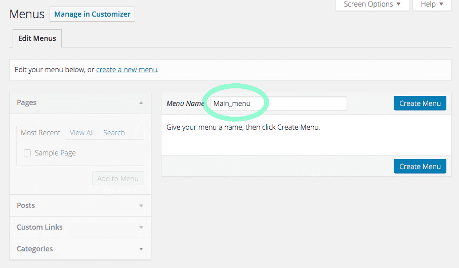
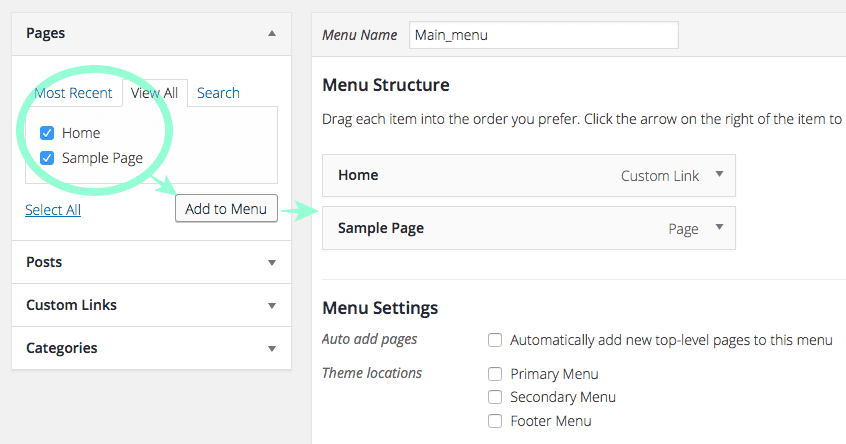
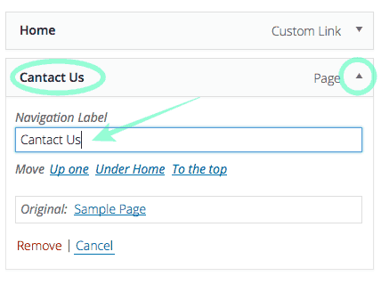
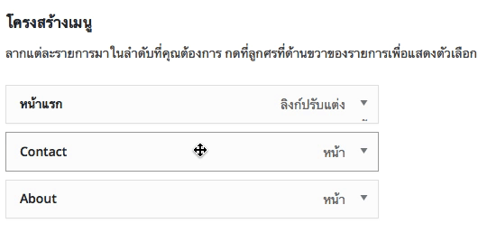
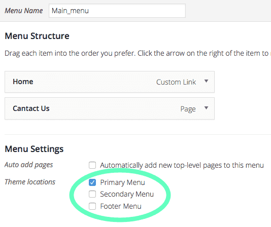
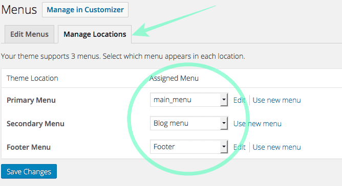

# การสร้าง Menu

### 1. สร้างชุดเมนูใหม่

ปกตินั้น WordPress จะเอา **หน้า** ที่เราสร้าง ไปกำหนดเป็น **เมนู** โดยอัตโนมัติ แต่เราสามารถที่จะสร้างเมนูของเราเองได้ โดยการไปที่เมนู **รูปแบบบล็อก &gt; เมนู** จากนั้นตั้งชื่อเมนูที่เราต้องการ ควรเป็นภาษาอังกฤษนะคะ เช่น ถ้าเป็นเมนูหลักก็ตั้งชื่อว่า Main\_menu เป็นต้น แล้วก็คลิกที่ปุ่ม **สร้างเมนู**  
แล้วทำการตั้งชื่อให้กับเมนูชุดนี้

### 2. เลือกสิ่งที่จะนำไปสร้างเป็นเมนู

ขั้นตอนต่อไปให้เราเล็งไปที่กล่องด้านซ้ายมือ จะมีแถบข้อมูลต่างๆ อยู่ เช่น Page \(หน้า\) Post \(เรื่อง\) Categories \(หมวดหมู่\) และอื่นๆ ที่สามารถให้เรานำมาสร้างเป็นเมนูเชื่อมโยงได้ อันนี้เราต้องสร้างข้อมูลเหล่านั้นก่อนนะคะ เช่น จะสร้างเมนูที่ลิงค์ไปยังหน้า Contact Us เราก็ต้องมีหน้า Contact Us ก่อน แล้วมันจะมาปรากฏที่ตรงนี้โดยอัตโนมัติ จากนั้นเราก็เพียงแต่คลิกเลือกไอเทมที่ต้องการ แล้วคลิกปุ่ม **Add to Menu**ได้เลยค่ะ มันก็จะไปอยู่ที่กล่องทางด้านขวา นั่นคือ**เมนู 1 ชุด** ของเรา

### 3. เปลี่ยนชื่อเมนู

ปกติแล้วเมื่อเรา Add to Menu นั้น ระบบจะตั้งข้อความบนเมนูนั้นตามชื่อของหน้านั้นๆ แต่เราสามารถที่จะแก้ไขเองให้เหมาะกับการใช้งานและสื่อความหมายของเราและเพื่อทำให้สั้นลงได้ โดยการคลิกที่ปุ่มลูกศรคลี่แถบเมนูของเมนูนั้นๆ เพื่อแสดงตัวเลือกออกมา แล้วให้เราทำการพิมพ์ข้อความที่ต้องการในช่อง Navigation Label ข้อความบนเมนูก็จะเปลี่ยนตามที่เราเขียน \(เดิมทีเป็น Sample Page\)

### 4. จัดตำแหน่ง

การจัดตำแหน่งของเมนูแต่ละตัวนั้นทำได้ง่ายๆ เพียงการลากและวาง เราสามารถที่จะสร้างซับเมนูได้ง่ายๆ ด้วยการลากเมนูที่ต้องการให้เป็นซับเมนู ไปวางซ้อนกับเมนูหลักที่ต้องการ

### 5. กำหนดตำแหน่งของเมนูชุดนั้นๆ

เราสามารถกำหนดตำแหน่งให้เมนูได้ แต่ขึ้นอยู่กับว่าธีมที่เราใช้งานนั้น สามารถมีเมนูได้กี่ตำแหน่งบ้าง โดย Primary Menu จะหมายถึงเมนูหลัก Secondary Menu เป็นเมนูรองที่มักมีขนาดเล็กกว่า และ Footer Menu คือเมนูที่อยู่ด้านล่าง ของหน้า เราสามารถใช้เมนูชุดเดียวกับหลายๆ ตำแหน่งได้ หรือใช้ชุดเมนูที่ต่างกันก็ได้

จากรูปด้านบน เมนูที่ 1  คือ Primary Menu เป็นเมนูหลัก, 2 คือ Secondary Menu และ 3 คือ Footer Menu

โดยทั้ง 3 ตำแหน่งนั้นเราใช้เมนูต่างชุดกัน คือทำการ Create Menu 3 รอบเพื่อสร้าง 3 เมนู แล้วกำหนดตำแหน่งให้มัน หรือเราสามารถที่จะกำหนดจากแท็บ **Manage Locations** ด้านบนก็ได้

 แค่นี้ก็เป็นอันเสร็จเรียบร้อยแล้วล่ะค่ะ ทุกขั้นตอนอย่าลืมกด Save Changes นะคะ

