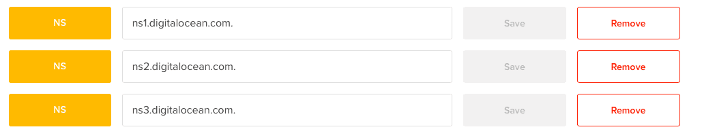
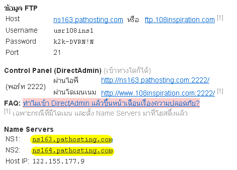
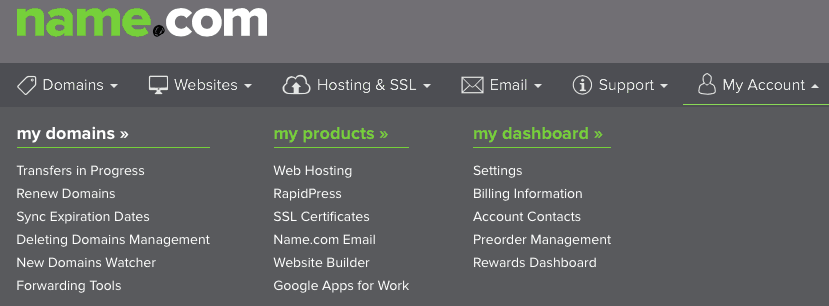
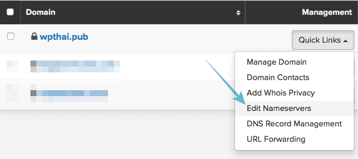
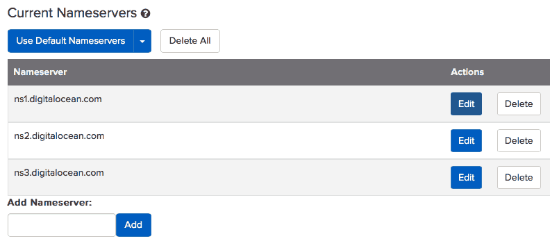

# การตั้งค่า Nameserver

การตั้งค่า Nameserver มักจะจำเป็นต้องใช้เมื่อเราเช่าโฮ้สต์และโดเมนแยกจากกัน หรือในกณีที่เราย้ายโฮ้สต์ เราก็ต้องชี้โดเมนของเราไปยัง Namesever ใหม่ของทางโฮ้สต์ เป็นการเชื่อมโดเมนและโฮ้สต์เข้าด้วยกัน

รายละเอียดของ Nameserver นั้นเราสามารถดูได้จากอีเมลที่ทางโฮ้สต์ส่งมาให้เรา หรือล็อกอินเข้าไปดูในระบบของทางโฮ้สต์

ขั้นตอนต่อไปนี้เราจะยกตัวอย่างการตั้งค่า Nameserver ที่ [name.com](https://www.wpthaiuser.com/go/name/) แต่หากผู้อ่านใช้ที่อื่นอยู่ ก็เพียงแค่หาเมนู Nameserver ให้เจอ การตั้งค่าอื่นๆ ก็คล้ายๆ กันค่ะ

ไปที่เมนู My Account &gt; My Domain

 คลิกตัวเลือก **Edit Nameservers** จากเมนู Quick Edit ที่โดเมนที่ต้องการ

 ทำการแก้ไขเลข Nameserver เดิมโดยการคลิกที่ปุ่ม Edit หรือคลิกปุ่ม Delete เพื่อลบออกทีละตัว แล้วกรอก Namesever ที่ต้องการตั้งค่าใหม่ใส่ในช่อง Add Nameserver แล้วคลิกปุ่ม Add จนครบทุกชุด ปกติจะมีประมาณ 3 ชุด แล้วจะมีปุ่ม Apply ให้เรากดอีกทีเพื่อยืนยันการแก้ไข โดเมนจะอัพเดตและลิงค์ไปยังโฮ้สต์ใหม่ภายใน 24-48 ชั่วโมง ไม่ใช่ในทันทีนะคะ \(แต่ส่วนใหญ่ก็ไม่ถึงชั่วโมงค่ะ ไม่สามารถควบคุมได้\)

