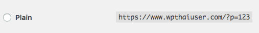
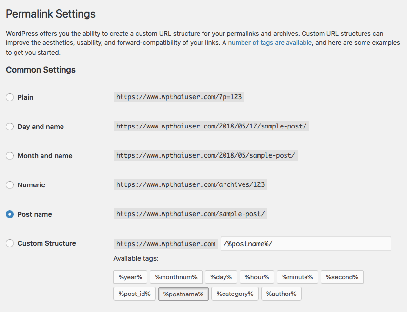

# การตั้งค่า Permalinks

 **Permalinks** คือ การแสดงผลของ URL ซึ่งใน WordPress นั้นเราสามารถที่จะตั้งค่า Permalinks ได้หลายแบบ โดยเบื้องต้นนั้น Permalink จะมาในรูแบบ Plain คือแสดงผลเป็น Post ID ของโพสนั้นๆ

 เราสามารถเปลี่ยนการตั้งค่า Permalink นี้ได้ง่ายๆ โดยการไปที่เมนู Settings &gt; Permalinks แล้วเลือกรูปแบบที่เราต้องการได้เลย

* **Plain** แสดงเป็น ID ของโพส
* **Day and Name** แสดงเป็น ปี/เดือน/วันที่ ตามด้วย Title หรือ ชื่อของบทความ
* **Month and Name** แสดงเป็น ปี/เดือน ตามด้วยชื่อของบทความ
* **Numeric** แสดงเป็น ID ของโพสเช่นกัน แต่แสดงในรูปแบบมี `/archives/` คั่น
* **Post name** แสดงเป็นชื่อของบทความเลย ซึ่งเป็นแบบที่นิยมที่สุด เนื่องจากเป็นมิตรกับคนอ่านและจดจำได้ง่ายและยังเป็นผลดีกับ SEO
* **Custom Structure** เป็นการกำหนดเอง โดยการคลิกเลือกตัวเลือกที่สามารถใช้ได้จากปุ่มต่างๆ ด้านล่าง ระบบก็จะใส่ให้อัตโนมัติ `%year%` ปี `%monthnum%` เดือน `%day%` วันที่ `%hour%` ชั่วโมง `%minute%` นาที `%second%` วินาที `%post_id%`ID ของโพส `%postname%` ชื่อบทความ `%category%` หมวดหมู่ `%author%` ผู้เขียน

หากมีการใช้งานปลั๊กอินบางอย่างที่เป็น Custom Post Type เช่น WooCommerce ก็อาจจะมีการตั้งค่า Permalinks ของปลั๊กอินเหล่านั้นด้วย

