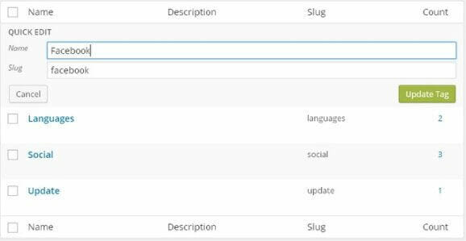

# Tags และ Categories

### การจัดการ Tags และ Categories

ในบทความก่อนหน้านี้ที่เราได้รู้เรียนรู้ [วิธีการสร้าง Post](https://www.wpthaiuser.com/%e0%b8%81%e0%b8%b2%e0%b8%a3%e0%b9%80%e0%b8%9e%e0%b8%b4%e0%b9%88%e0%b8%a1-post-%e0%b8%ab%e0%b8%a3%e0%b8%b7%e0%b8%ad-page/) ไปแล้ว จะเห็นว่าเราสามารถเพิ่ม Categories และ Tags ให้กับบทความต่างๆ เพื่อกำหนดคุณสมบัติและการเชื่อมโยงของบทความในเว็บ แต่เราจะเห็นว่ามีแต่ให้เพิ่ม แต่หากเราต้องการที่จะแก้ไข หรือ ลบ ล่ะ จะทำยังไง การแก้ไขหรือลบ Tags และ Categories นั้นสามารถทำได้ด้วยการไปที่มเนู **Posts &gt; Categories** หรือ **Posts &gt; Tags**

### Categories

ที่ฝั่งขวาของเมนู Categories เราจะเจอกับเครื่องมือที่ไว้ใช้แก้ไข categories ที่เราได้สร้างไว้ตอนเขียนบทความ โดยมีชื่อ category, slug และ count แสดงจำนวนบทความใน categories นั้นๆ เราสามารถแก้ไข category แต่ละอันได้ด้วยการชี้เม้าส์ไปที่ยังตัวที่เราต้องการแก้ไขแล้วเลือก Edit, Quick Edit, Delete หรือ View

#### Quick Edit

ใช้สำหรับการแก้ไขชื่อและ slug โดย slug นั้นเปรียบได้กับเป็น url ของ Tag หรือ Category นั้นๆ เช่น category **ทิป** แต่เรากำหนด slug เป็นภาษาอังกฤษว่า **Tips** แทน เพื่อให้สั้นและง่ายต่อการเข้าถึง เมื่อเรียกดู category **ทิป** นี้เราก็จะเห็น url เป็น https://www.wpthaiuser.com/category/tips โดยที่ชื่อ category นี้ยังเป็น **ทิป** เหมือนเดิม

#### Edit

ใช้สำหรับการแก้ไขเพิ่มเติมนอกเหนือจากชื่อและ slug โดยเราสามารถกำหนด Parent category หรือ หมวดหมู่หลักให้กับ category นั้นๆ ได้ ยกตัวอย่างเช่น เราสร้าง category ชื่อ **New Update** เพื่อเขียนบทความเกี่ยวกับการอัพเดตของ WordPress เวอร์ชั่นต่างๆ ดังนั้นเราจะกำหนด category นี้ให้อยู่ในใต้ category ชื่อ **ข่าว** อีกที เพราะการอัพเดตก็ถือเป็นข่าวอีกหมวดหมู่หนึ่งเช่นกัน

### Tags

เนื่องจาก Tags นั้นไม่มี Parent หรือไม่สามารถสร้างเป็นแท็กหลักแท็กรองได้ ดังนั้นเราจึงแก้ไขได้แค่ ชื่อ และ slug เท่านั้น ดังนั้นไม่ว่าจะใช้ Edit หรือ Quick Edit ก็ไม่ต่างกัน แต่ใช้ Quick Edit จะรวดเร็วกว่าเนื่องจากไม่ต้องรอโหลดใหม่

### Delete Categories, Tags

เราสามารถลบ Categories หรือ Tags ได้ด้วยวิธีเดียวกัน คือ การเช็คถูกที่ category หรือ tag ที่เราต้องการลบ แล้วเลือก **Bulk Actions** เป็น **Delete**

