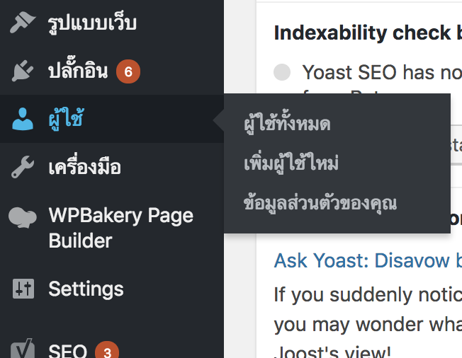
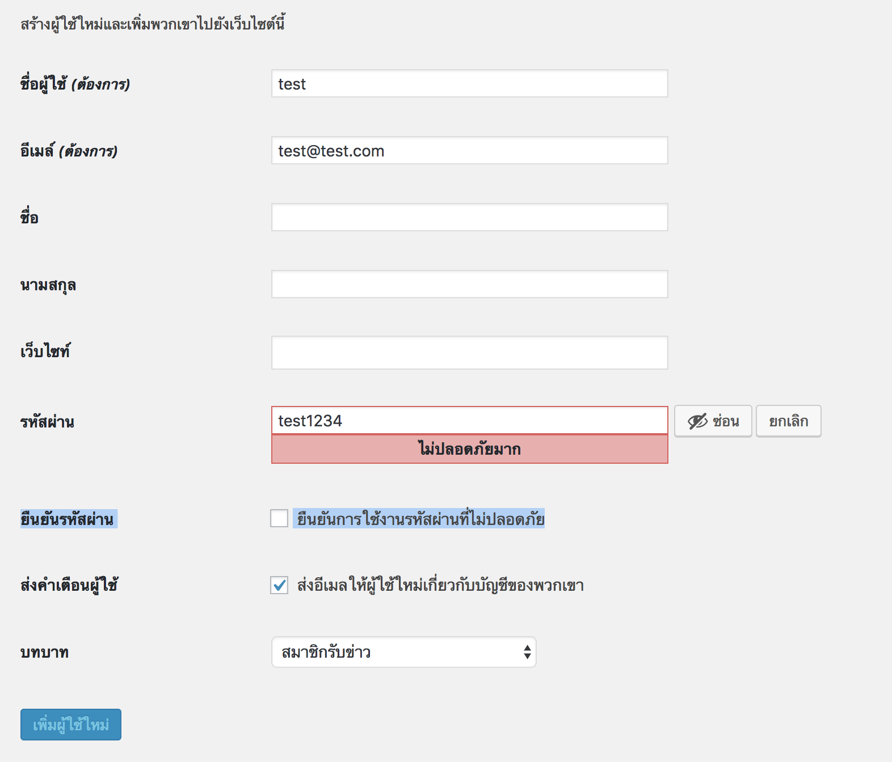
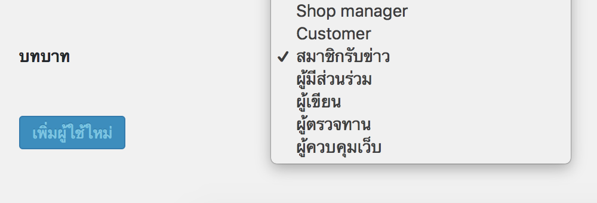

# การเพิ่มผู้ใช้ และตั้งค่าบทบาทผู้ใช้

ขั้นตอนแรกให้ไปที่หลังบ้านของเว็บไซต์ลูกค้า จากนั้นเลือกไปที่เมนู ผู้ใช้ หรือ User 

ให้เลือกที่เมนู เพิ่มผู้ใช้ใหม่จะปรากฏหน้าจอดังภาพ โดยสิ่งที่สำคัญที่จะต้องกรอกคือ ชื่อผู้ใช้\(username\) และ อีเมล เป็น 2 สิ่งที่ต้องกรอกก่อนจะเพิ่ม มิเช่นนั้นจะไม่สามารถเพิ่มได้

หลังจากที่กรอกชื่อผู้ใช้\(username\)และอีเมลแล้วนั้น  ต่อไปให้ตั้ง Username และ Password ต่อได้เลย หาก Password ที่ตั้งนั้นไม่ปลอดภัยในทำเครื่องหมายถูกในช่องยืนยันการใช้รหัสด้วยดังภาพ

หลักจากที่ยืนยันที่จะใช้รหัสผ่านนี้แล้วช่องต่อไปจะเป็นสิทธิ์หรือบทบาทในการใช้งานหลังบ้านของ User นั้นๆ

จาก user ที่ทางบริษัทได้ให้ลูกค้าจะเป็น ผู้ควบคุมเว็บหรือ Admin นั่นเองซึ่ง บทบาทนี้สามารถทำได้ทุกอย่างแก้ไขได้ทุกอย่างภาพในเว็บไซต์ หากลูกค้าเป็นเว็บขายของต้องการคนมาดูแล stock สินค้า การขายต่างๆก็สามารถเลือกเพียง Shop Manager ได้ หากเลือกเป็น Shop Manager ก็จะสามารถดูแลการขายได้เท่านั้นไม่สามารถแก้ไขข้อมูลข้อความต่างๆภายในเว็บไซต์ได้นอกจากข้อมูลสินค้าเท่านั้น

