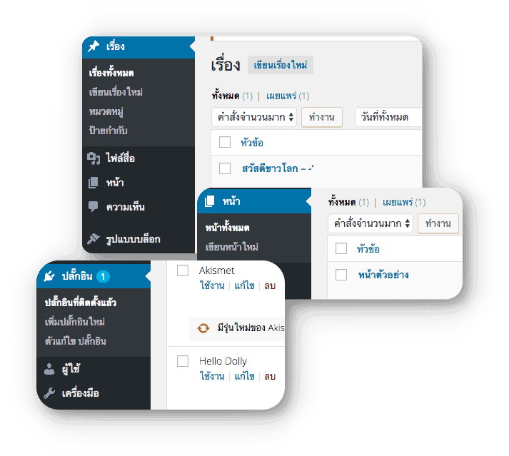
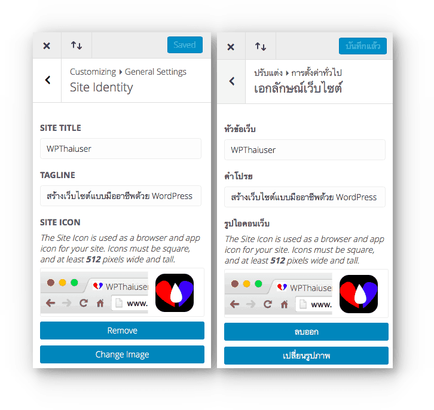

# การตั้งค่าเบื้องต้น

#### ลบข้อมูลเก่า

ลบข้อมูลเดิมที่มากับ WordPress ออก เช่นปลั๊กอิน Hello Dolly ยกเว้นปลั๊กอิน Akismet ที่ใช้ในการป้องกันสแปม ใช้ดีพอสมควรเลยค่ะ ส่วน Posts, Pages ที่มีอยู่แล้ว เช่นพวก Hello Word พวกนี้ไม่ต้องเอาไว้ค่ะ โดยการไปที่เมนู

* Posts &gt; All Posts เลื่อนเม้าส์เหนือโพส Hello World! แล้วคลิกปุ่ม Trash \(เรื่อง &gt; เรื่องทั้งหมด &gt; สวัสดีชาวโลก &gt; ถึงขยะ\)
* Pages &gt; All Pages เลื่อนเม้าส์ไปที่ Sample Page แล้วคลิกปุ่ม Trash \(หน้า &gt;  หน้าทั้งหมด &gt; หน้าตัวอย่าง &gt; ถังขยะ\)
* Plugins &gt; Installed Plugins เลื่อนเม้าส์เหนือ Hello Dolly แล้วเลือก Delete เพื่อลบ \(ปลั๊กอิน &gt; ปลั๊กอินที่ติดตั้งแล้ว &gt; ลบ\)

#### ตั้งค่า Permalinks \(ลิงค์ถาวร\)

ไปที่เมนู Settings &gt; Permalinks \(ตั้งค่า &gt; ลิงค์ถาวร\) คือการกำหนดลักษณะการแสดง URL ของเว็บเราบน Address bar ของบราวเซอร์ว่าแต่ละบทความจะแสดงยังไง แสดงโดยใช้ id ของบทความ\(WordPress เก็บบทความและข้อมูลต่างๆ ลงบนฐานข้อมูลทั้งหมดโดยอ้างอิงเป็น id\)  แสดงแบบมีวันเดือนปีคั่น และอื่นๆ ปกติเราจะแนะนำให้ใช้ _ชื่อเรื่อง_ หรือ Post name เพราะจะจำง่ายกว่า โดยระบบจะสร้าง URL ตามชื่อเรื่อง ที่เราเขียนเพื่อให้ง่ายต่อการจดจำและหวังผลในเรื่อง Seo แต่ก็อาจจะแสดงไม่ครบสำหรับชื่อไทยยาวๆ สามารถใช้ปลั๊กอิน [Lonk URL Maker](https://www.wpthaiuser.com/%e0%b9%81%e0%b8%81%e0%b9%89%e0%b8%9b%e0%b8%b1%e0%b8%8d%e0%b8%ab%e0%b8%b2-url-%e0%b8%a0%e0%b8%b2%e0%b8%a9%e0%b8%b2%e0%b9%84%e0%b8%97%e0%b8%a2%e0%b9%82%e0%b8%94%e0%b8%99%e0%b8%95%e0%b8%b1%e0%b8%94/) เพื่อแก้ปัญหานี้ได้ แต่เราไม่แนะนำให้ใช้ URL ภาษาไทย เพราะบางทีบราวเซอร์ไม่รองรับ ก็จะแสดงเป็นอักขระแปลกๆ ไม่น่าไว้ใจ รวมไปถึงการตั้งชื่อไฟล์ภาพต่างๆ ห้ามตั้งชื่อเป็นภาษาไทยอย่างเด็ดขาด เพราะอาจมีปัญหาภายหลังได้

#### ตั้งค่า Site Title และ Tagline และ Favicon

ไปที่เมนู  Appearance &gt; Customize \(รูปแบบบล็อก &gt; ปรับแต่ง\) เป็นการตั้งค่าข้อความหลักและไอคอนให้กับเว็บ โดยจะเห็นได้ชัดเจนเวลาที่เราอยู่หน้าแรก \(Home\) เพราะถ้าเป็นหน้าอื่นๆ ตรง Tagline ก็จะเปลี่ยนไปตามชื่อของบทความนั้นๆ

#### ตั้งค่าวันที่ เวลา ภาษา

ไปที่เมนู  Settings &gt; General \(ตั้งค่า &gt; ทั่วไป\) วันที่ เวลา ภาษา จะแสดงบนหน้าเว็บของเรา เช่น แสดงว่าที่บทความถูกเผยแพร่ โดยจะมีการให้เลือก โซนเวลา การแสดงผลเวลาในแบบต่างๆ และการเลือกภาษา ซึ่งภาษานี้จะเปลี่ยนการแสดงผลของหน้าควบคุม \(Dashboard\) ด้วย

#### เปลี่ยนชื่อสำหรับการใช้แสดงผลบนหน้าเว็บ

ไปที่เมนู  Users &gt; Your Profile \(ผู้ใช้ &gt; ข้อมูลส่วนตัวของคุณ\) ทำการเพิ่ม ชื่อ นามสกุล \(อาจจะใช้ตามความจริงหรือไม่ก็ได้\) และชื่อเล่น เสร็จแล้วใน ชื่อที่แสดงให้คนทั่วไปเห็น ให้เลือกเป็นชื่อใดที่ชื่อที่ไม่ซ้ำกับชื่อ Username ของเรา ในตัวอย่างเราจะใช้ ชื่อเล่น แทนค่ะ ทำเช่นนี้เพื่อความปลอดภัย ช่วยให้การสุ่มชื่อ username สำหรับการแฮ็คเว็บไซต์ยากขึ้น

