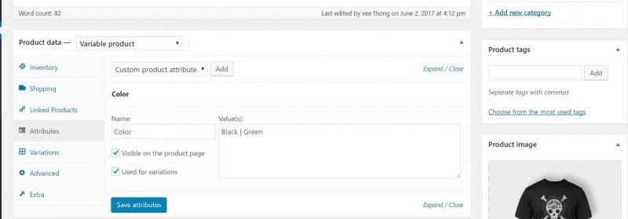
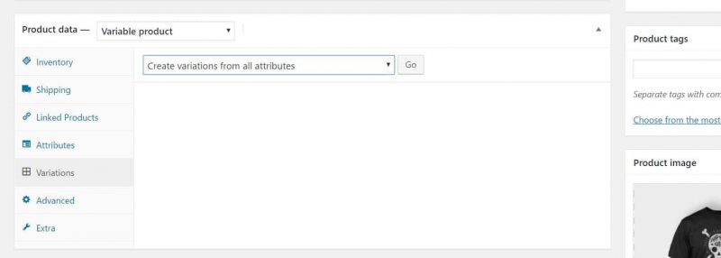
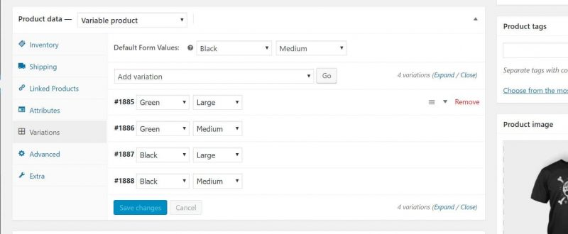
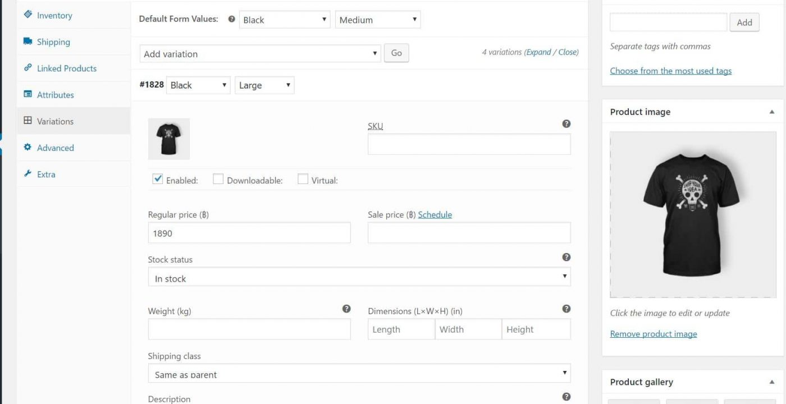
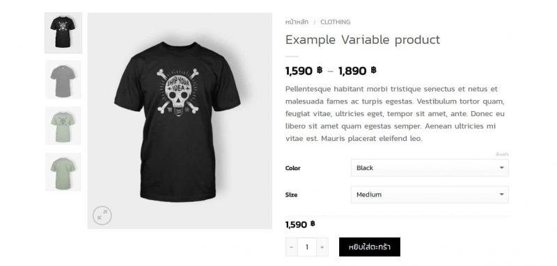

# การลงสินค้าประเภทต่างๆ

**หลักการเพิ่มข้อมูลสินค้า ทุกๆ Product ต้องมี 6 สิ่งต่อไปนี้**

1. ชื่อสินค้า
2. ติ๊ก Categories \(หมวดหมู่สินค้า\)
3. เนื้อหา \(ช่อง text editor\) – ช่องด้านบน &gt;&gt; แสดงข้อมูลขนาดยาวด้านล่างของรูปภาพสินค้า – ช่องด้านล่าง &gt;&gt; แสดงด้านข้อมูลแบบย่อๆ ข้างรูปภาพสินค้า
4. ราคาสินค้า
5. Product image \(รูปภาพหน้าปกสินค้า\) ควรเป็นไซต์ขนาดสีเหลี่ยมจตุรัสหรือสีเหลี่ยมพื้นผ้าเลือกอย่างใดอย่างหนึ่ง ขนาดไฟล์รูปอย่าให้เกิน 100 kb
6. Product Gallery \(รูปภาพประกอบสินค้า\) รูปไซต์ไหนก็ได้ แต่ขนาดไฟล์รูปอย่าให้เกิน 100 kb เช่นเดียวกัน

**เราต้องใส่ให้ครบตามนี้ ดูรูปภาพประกอบนะครับ**

**สินค้าแบบ Simple Product ข้อมูลส่วนหลังบ้าน**

**ตัวอย่างสินค้าแบบ Simple product**

#### การลงสินค้าแบบ Variable product

1. ลงรายละเอียดสินค้าพื้นฐานให้เรียบร้อย
2. ในส่วนของ product data ให้เราเลือกประเภทเป็น Variable product
3. สร้าง attribute \(คุณลักษณะ\) ของสินค้า มีวิธีการทำดังนี้ – คลิกตรง attribute &gt;&gt; คลิก add &gt;&gt; ตั้งชื่อ attribute เช่น color &gt;&gt; ตั้งค่า attribute ที่เรามีเช่น สีดำ สีเขียว โดยเราจะใช้ภาษาใดในการเขียนก็ได้ แต่ให้ใช้สัญลักษณ์ \| ในการเพิ่มค่าอื่นๆ เช่น Black \| Green

\*\*อย่าลืมติ๊กถูกที่ Visible on the product page และติ๊กที่ Used for variations

\*\* หากต้องการเพิ่ม attribute ก็คลิก add เพิ่มได้เลยเช่น ขนาดของเสื้อ S \| M \| L

4. ให้ไปที่ Variations เลือก Create variations from all attributes คลิก Go ได้เลย

 5.  กำหนดข้อมูลสินค้าของแต่ละ Variations ได้เลยครับ เราสามารถตั้งราคา รูปภาพ และข้อมูลสินค้าของแต่ละตัวให้แตกต่างกันได้

\*\*ตั้งค่า Variations ให้ครบทุกตัวนะครับ

**เมื่อทุกอย่างเรียบร้อย การแสดงผลหน้าสินค้า Variable product ของเราจะเป็นแบบนี้ครับ**

