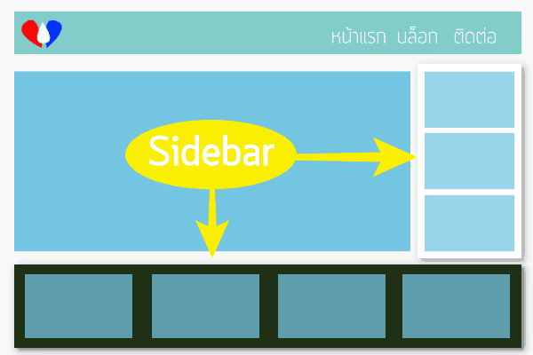

# การตั้งค่า Widget

ในรูปด้านบนจะเห็นว่าเรามี Sidebar 2 ตำแหน่งด้วยกัน คือด้านขวา อันนี้เรียกว่าและด้านล่าง ปกติด้านล่างนี้จะเรียกว่า Footer sidebar \(พื้นที่ขอบล่าง\) และกล่องต่างๆ ที่อยู่ข้างในเหล่านั้นก็คือ **วิดเจ็ต** นี้เอง Footer Sidebar จะต่างจาก Sidebar ปกติคือ แต่ละช่องจะถือว่าเป็นหนึ่ง sidebar อย่างในรูปนับจากซ้ายไปขวาก็จะเป็น Footer 1, Footer 2, Footer 3, Footer 4 เป็นต้น

เราสามารถเพิ่มวิดเจ็ตได้ด้วยการไปที่เมนู **รูปแบบบล็อก &gt; วิดเจ็ต** \(Appearance &gt; Widgets\) จากนั้นคลิกวิดเจ็ตที่ต้องการจากแล้วเลือกว่าจะใช้วิดเจ็ตนี้ที่ sidebar ไหน แล้วคลิกที่ปุ่ม **เพิ่มวิดเจ็ต** วิดเจ็ตก็จะถูกเพิ่มไปยังตำแหน่งที่เราเลือก

 จากนั้นคลิกที่วิดเจ็ตที่เราเพิ่มไปบน sidebar แล้วทำการตั้งค่าตามที่ต้องการ แต่ละตัวก็มีการตั้งค่ามากน้อยต่างกันไป

 เราสามารถที่จะคลิกเพื่อลากวิดเจ็ตสลับตำแหน่งได้ ลากข้าม sidebar ก็ได้

วิดเจ็ตจะถูกบันทึกโดยอัตโนมัติและเราสามารถดูที่หน้าเว็บได้เลย

อีกวิธีหนึ่งที่เราสามารถใช้เพิ่มวิดเจ็ตได้ก็คือ การใช้เมนู [Customize](https://www.wpthaiuser.com/customize/) \(รูปแบบบล็อก &gt; ปรับแต่ง หรือคลิก ปรับแต่ง บนทูลบาร์เวลาอยู่ที่เว็บด้านหน้าก็ได้\) ซึ่งจะแสดงให้เราเห็นการเปลี่ยนแปลงได้เลย

 สามารถแทรกโค้ดที่ Sidebar ได้โดยเพิ่ม Text widget \(ข้อความ\) ไปที่ sidebar ที่ต้องการ

