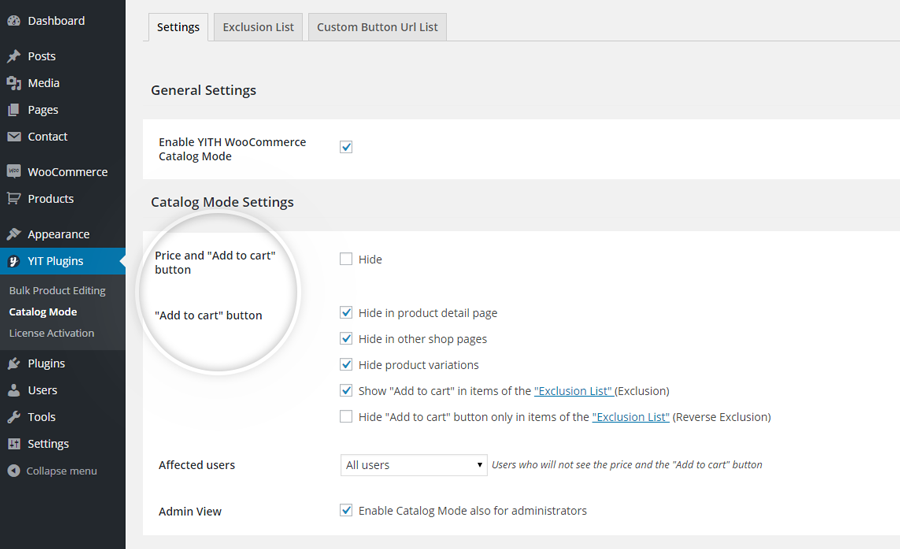
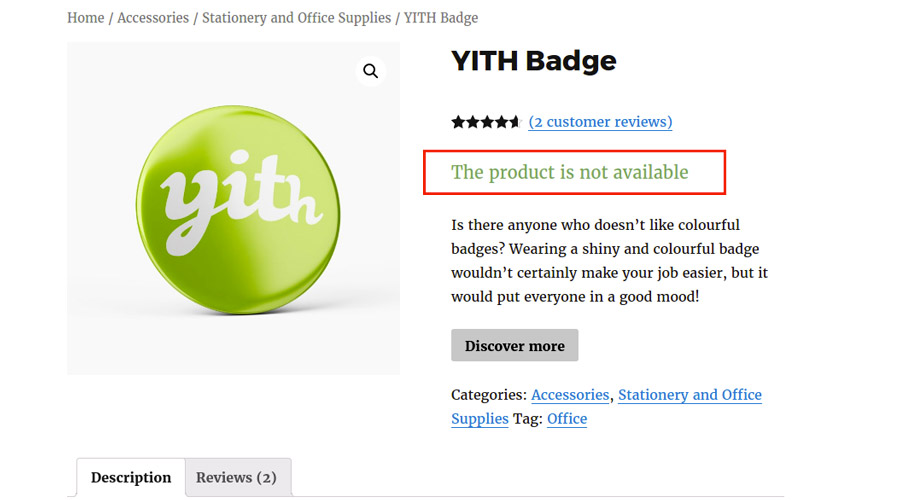
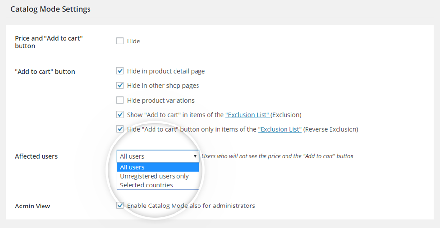
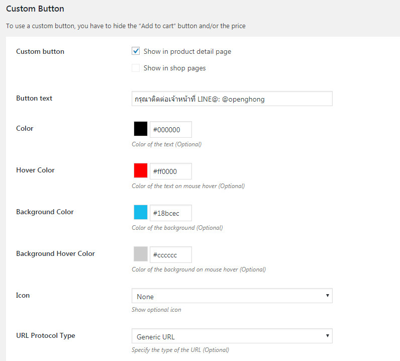
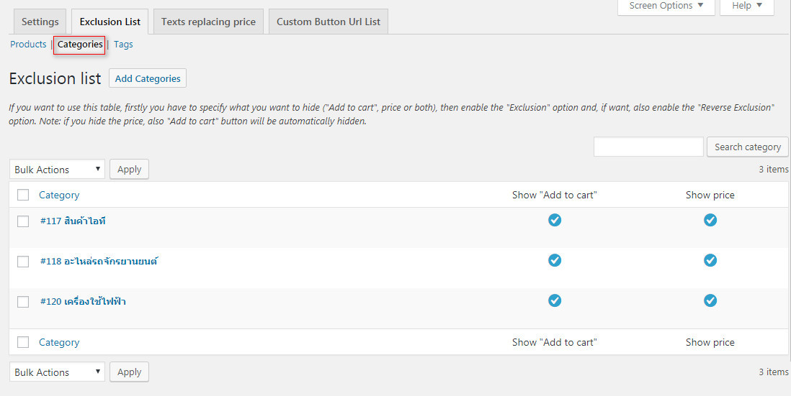
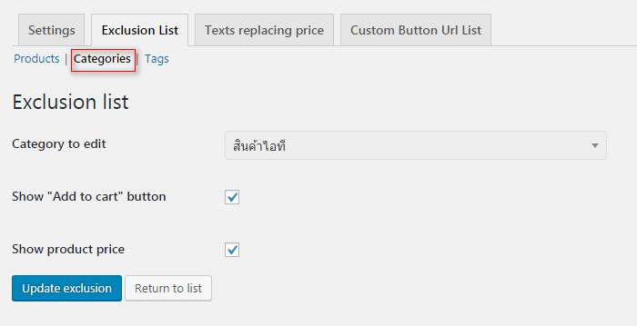
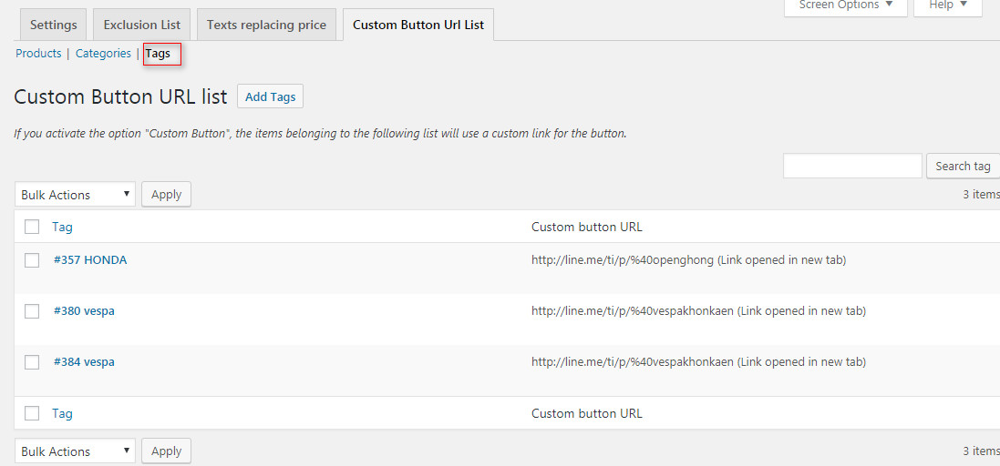
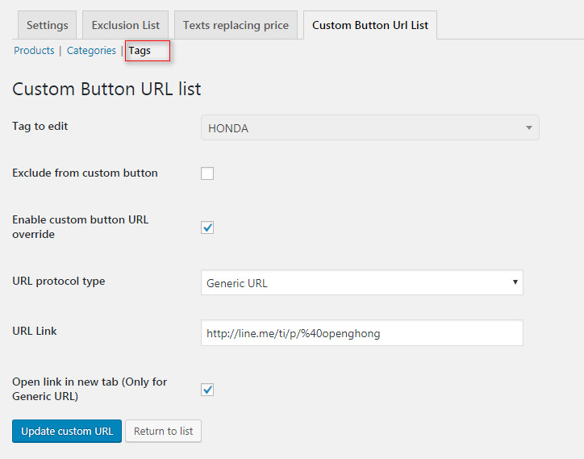
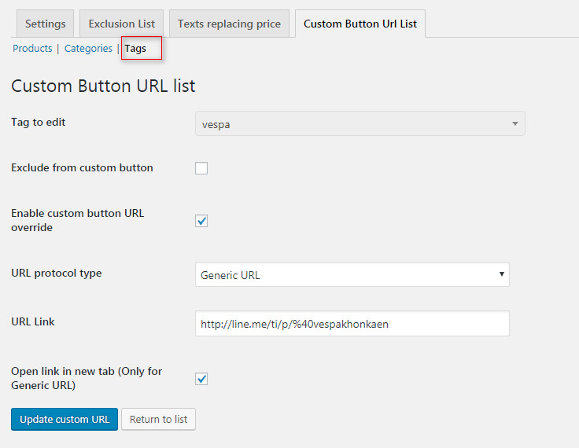

# การใช้งาน YITH Catalog Mode

ข้อมูลอ้างอิง [https://docs.yithemes.com/yith-woocommerce-catalog-mode/](https://docs.yithemes.com/yith-woocommerce-catalog-mode/)

**ซ่อน ราคา และ ปุ่ม ตะกร้าสินค้า**

 **รายการการยกเว้น คือ จะมีปุ่มตะกร้าและราคาเป็นปกติ โดยเลือกได้ว่าจะเป็น สินค้า, หมวดหมู่สินค้า, แท็ก**

 **รายการ URL ปุ่มที่กำหนดเอง**

